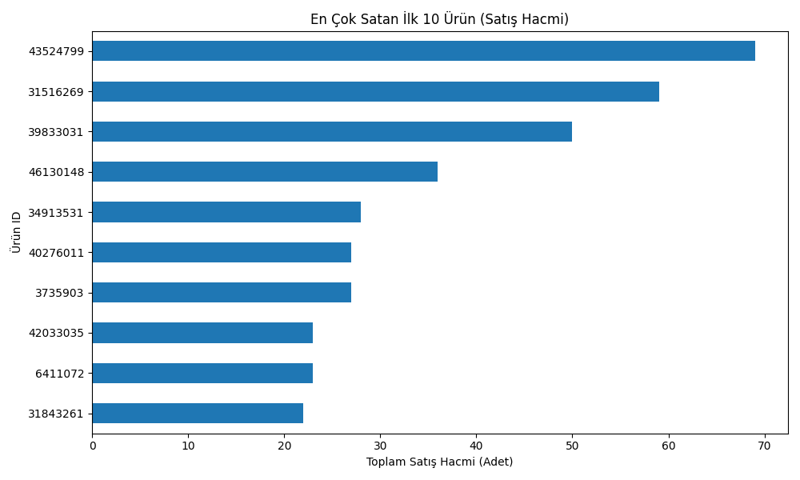
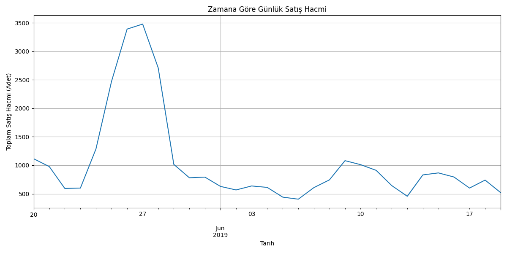

# E-Ticaret Satış Analizi Projesi

Bu proje, bir e-ticaret sitesine ait (kurgusal) satış verilerini analiz ederek şirketin satış performansını, en popüler ürünlerini ve veri kalitesi sorunlarını ortaya çıkarmayı amaçlamaktadır. Analizin temel hedefi, yönetime "hangi ürünlere odaklanmalı" sorusuna veri odaklı yanıtlar sunmaktır.



## Kullanılan Teknolojiler

* **Python 3**
* **Pandas:** Veri manipülasyonu, temizliği ve analizi için.
* **NumPy:** Sayısal işlemler ve veri temizliğindeki (NaN) yardımlar için.
* **Matplotlib:** Veri görselleştirmesi (grafikler) için.

## Projeyi Çalıştırma

Projeyi kendi bilgisayarınızda çalıştırmak için aşağıdaki adımları izleyebilirsiniz:

1.  **Depoyu klonlayın:**
    ```bash
    git clone [https://github.com/enesbilgin0/E-Ticaret-Analizi.git](https://github.com/enesbilgin0/E-Ticaret-Analizi.git)
    cd E-Ticaret-Analizi
    ```

2.  **Gerekli kütüphaneleri yükleyin:**
    ```bash
    pip install pandas numpy matplotlib
    ```

3.  **Python script'ini çalıştırın:**
    ```bash
    python main.py
    ```
    Script çalıştığında, analiz raporunu konsolda gösterecek ve `images/` klasörüne en güncel grafikleri kaydedecektir.

## 📊 Analiz ve Bulgular

Analiz, `data/` klasöründeki `basket_details.csv` ve `customer_details.csv` dosyaları birleştirilerek yapılmıştır.

### 1. Satış Performansı (Zamana Göre)

Analiz edilen **2019-05-20** ile **2019-06-19** tarihleri arasındaki bir aylık dönemde toplam **32,306 adet** ürün satışı (satış hacmi) gerçekleşmiştir. Günlük satış hacminde belirgin bir düşüş veya artış trendi gözlenmemiştir.



### 2. En Popüler Ürünler

Satış hacmine göre en çok satan ürünler, şirketin odaklanması gereken "lokomotif" ürünlerdir.

**En Çok Satan İlk 3 Ürün:**
* Ürün ID: `43524799` (Toplam 69 adet)
* Ürün ID: `31516269` (Toplam 59 adet)
* Ürün ID: `39833031` (Toplam 50 adet)

### 3. Bölgesel Analiz (Eksik Veri Tespiti)

Projenin ana hedeflerinden biri "Hangi şehirlerde pazarlama artırılmalı?" sorusuna yanıt aramaktı.

**Bulgu:** `customer_details.csv` veya `basket_details.csv` dosyalarında müşterilerin konumu (şehir, bölge, vb.) hakkında **hiçbir veri bulunmamaktadır.** Bu nedenle, bölgesel bir pazarlama analizi yapılması mevcut verilerle **mümkün değildir.**

## Yönetim Ekibi İçin Öneriler

> **Ürün Stratejisi:** En çok satan ilk 3 (veya ilk 10) ürünün stok yönetimi kritik öneme sahiptir. Bu ürünler, pazarlama kampanyalarında ve çapraz satış (cross-sell) stratejilerinde anahtar olarak kullanılmalıdır.

> **Veri Toplama Stratejisi:** Gelecekte bölgesel pazarlama kampanyaları yapabilmek için müşteri kayıtlarına veya sipariş detaylarına **şehir/konum bilgisi** eklenmesi zorunludur.

## Tespit Edilen Diğer Veri Kalitesi Sorunları

* **Kritik Eksik Veri:** Müşteri detaylarını içeren `sex` (cinsiyet) ve `tenure` (müşteri olma süresi) sütunlarındaki verilerin **%99.52'si boştur (NaN)**. Bu durum, demografik analizi imkansız hale getirmiştir.
* **Anomalili Veri Temizliği:** `customer_age` (müşteri yaşı) sütununda $123$ ve $2022$ gibi imkansız yaş verileri tespit edilmiş; bu veriler temizlenerek yerlerine veri setinin medyan yaşı (34) atanmıştır.
